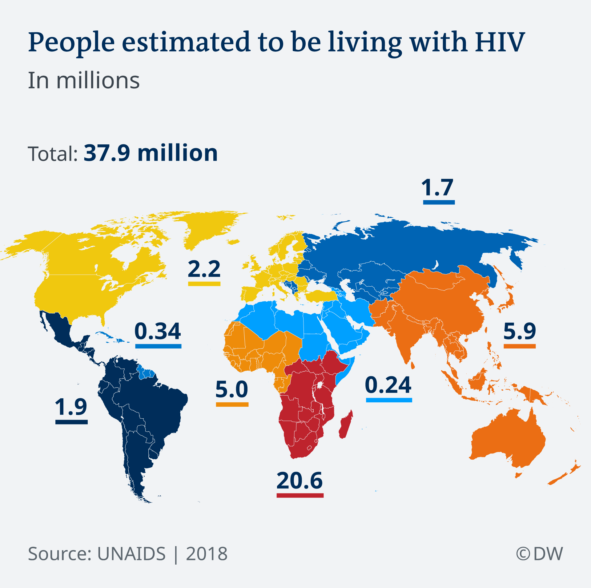
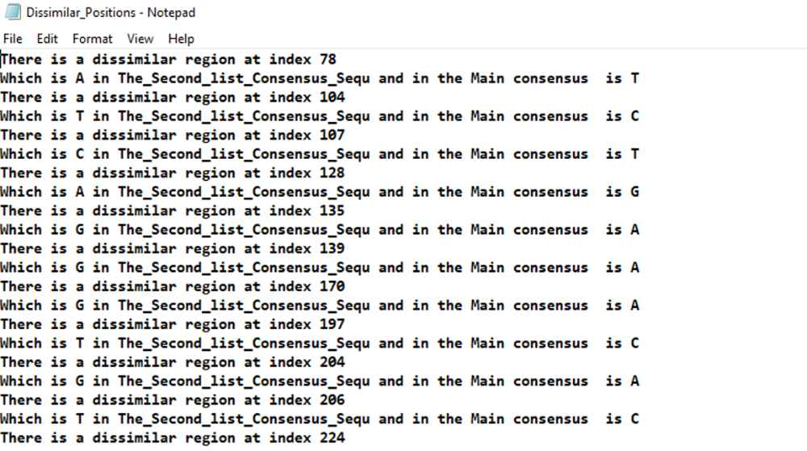

# Comparative Computational Analysis of HIV-1 Sequence Variants in Africa and Europe 🌍

## Introduction

Human Immunodeficiency Virus type-1 (HIV-1), the causative agent of Acquired Immunodeficiency Syndrome (AIDS), has led to over 34 million deaths and poses a continuous threat, potentially claiming over two million lives annually without effective therapeutic intervention [^1]. HIV, once contracted, becomes a lifelong condition. Untreated, it results in progressive CD4+ T cell loss, immunological abnormalities, and heightened risks of infectious and oncological complications. However, with proper medical care, HIV can be effectively controlled, enabling individuals to lead long, healthy lives while safeguarding their partners [^2].

⭐ Our study focuses on the genetic makeup of HIV-1, specifically exploring variations between continents. 
The objective is to compare HIV-1 sequences from Africa and Europe, employing a fully automated Python script to highlight potential effects stemming from regional differences.

## Material and Methods

### Computational Environment

All computational steps were conducted using Python 3 [^4].

### Data Collection

We obtained twenty whole genome sequences for HIV-1, ten from Africa and ten from Europe, using the Entrez function from the NCBI virus database. Subsequently, two new files were created to store the sequences separately.

### Sequence Alignment

Multiple alignments were performed using the Clustalw Command Line. Sequences from Africa and Europe were aligned separately to create consensus sequences. The dissimilar regions were identified by aligning the consensus sequences of Africa and Europe.

### Dissimilar Regions Extraction

A function was developed to extract the index of dissimilar regions, providing the original sequence and the dissimilar one.

### Functional Products/Interpretations

Following the extraction of dissimilar region data, the two consensus sequences were imported into the NCBI ORF finder tool. This facilitated the retrieval of all open reading frames (ORFs) in the sequences and their corresponding functional products using the Pfam website.

## Results and Discussion

### Alignment

All performed alignments were saved in separate files.

### Dissimilar Regions

Indexes of dissimilar regions, along with their original and dissimilar sequences, were saved in a Dissimilar_positions file, available for download after code execution. The results indicate dissimilar regions across the whole genome due to different continents of origin.

### Functional Products/Interpretations

In this study, we compared four predicted ORFs from the consensus sequences of Africa and Europe. The NCBI ORF finder results reveal that ORF1 in the first consensus sequence corresponds to ORF15 in the second sequence.
Analyzing the protein sequences via the Pfam website, we identified that the second sequence from Europe lacks Gag_p17 and Gag_p24 N-terminal domains. These sequences contain 129 dissimilar regions, potentially leading to variations in functional products. Mutations may result in inefficient Gag targeting to the plasma membrane, significantly reducing virus production.

## Conclusion

This study, conducted on the same HIV-1 virus, emphasizes the environmental impact on virus development. By changing continents, the virus's whole genome acquires different nucleotides, potentially leading to varied functional products. The criticality of these functional products to the virus influences its behavior and transmission dynamics. Our computational approach provides valuable insights into these variations, contributing to the understanding of HIV-1 dynamics in different geographic regions.

[^1]: [Ghanam, R. H., Samal, A. B., Fernandez, T. F., & Saad, J. S. (2012). Role of the HIV-1 Matrix Protein in Gag Intracellular Trafficking and Targeting to the Plasma Membrane for Virus Assembly. *Frontiers in Microbiology*, 3, 55. doi:10.3389/fmicb.2012.00055](https://doi.org/10.3389/fmicb.2012.00055)

[^2]: [Deeks, S. G., Overbaugh, J., Phillips, A., & Buchbinder, S. (2015). HIV infection. *Nature Reviews Disease Primers*, 1, 15035. doi:10.1038/nrdp.2015.35](https://doi.org/10.1038/nrdp.2015.35)

[^4]: [Van Rossum, G., & Drake, F. L. (2009). Python 3 Reference Manual.](https://docs.python.org/3/reference/index.html)

## Team Members 👥

A big thank you to my team members for your hard work and collaboration have been key to our project's success. Here's to a fantastic team!

- Ahmed Nabil Elghamry [Linkedin](https://www.linkedin.com/in/ahmed-elghamry-7b22829a/)
- Sherouk Mahmoud [Linkedin](https://www.linkedin.com/in/sherouk-mahmoud-567585143/)

## References

